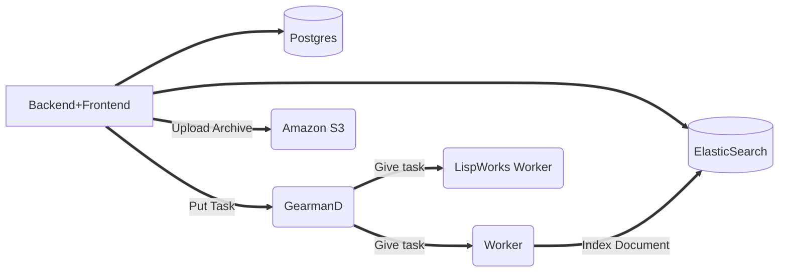

```mermaid
graph LR;
  B[Backend+Frontend] ==> DB[(Postgres)];
  B ==> ES[(ElasticSearch)];
  B == Put Task ==> G(GearmanD);
  B == Upload Archive ==> S3(Amazon S3);
  W(Worker) == Index Document ==> ES;
  G == Give task ==> LW(LispWorks Worker);
  G == Give task ==> W;
```
